# ScaleLink Architecture

## Component Overview

```mermaid
flowchart LR
    subgraph presentation [Presentation Layer]
        AC[AuthController]
        UC[UrlController]
        RC[RedirectController]
        AnC[AnalyticsController]
        DC[DashboardController]
    end

    subgraph security [Security Layer]
        JWT[JwtAuthenticationFilter]
        RL[RateLimitFilter]
        SEC[SecurityConfig]
    end

    subgraph service [Service Layer]
        AS[AuthService]
        US[UrlService]
        RS[RedirectService]
        AnS[AnalyticsService]
        DS[DashboardService]
        RLS[RateLimitService]
    end

    subgraph cache [Cache Layer]
        UCS[UrlCacheService]
        ACS[AnalyticsCacheService]
        PUC[PopularUrlCacheService]
        RTB[RedisTokenBucket]
    end

    subgraph data [Data Layer]
        REPO[JPA Repositories]
        PG[(PostgreSQL)]
        REDIS[(Redis)]
    end

    presentation --> security
    security --> service
    service --> cache
    service --> REPO
    cache --> REDIS
    REPO --> PG
```



## Layer Responsibilities

| Layer | Responsibility |
|-------|----------------|
| Controller | HTTP mapping, validation, OpenAPI docs |
| Security | JWT auth, rate limiting, access control |
| Service | Business logic, transactions, orchestration |
| Cache | Cache-aside, token bucket, popular URL refresh |
| Repository | Data access, optimized queries |
| Entity | JPA domain models |

## Package Structure

```
com.scalink/
├── config/          # Spring configuration
├── controller/      # REST endpoints
├── service/         # Business logic
├── repository/      # Data access
├── entity/          # JPA entities
├── dto/             # Request/response objects
├── security/        # JWT, SecurityUser
├── cache/           # Redis cache services
├── ratelimit/       # Token bucket rate limiting
├── observability/   # Correlation IDs, metrics filters
├── exception/       # Global error handling
└── util/            # Base62, URL validation, parsers
```

## Deployment Architecture

```mermaid
flowchart TB
    subgraph aws [AWS]
        subgraph vpc [VPC]
            ALB[Application Load Balancer]
            subgraph ec2 [EC2 Auto Scaling Group]
                EC2A[EC2 Instance A]
                EC2B[EC2 Instance B]
            end
            RDS[(RDS PostgreSQL)]
            ElastiCache[(ElastiCache Redis)]
        end
        S3[S3 Backups]
        CW[CloudWatch Metrics]
    end

    Users --> ALB
    ALB --> EC2A
    ALB --> EC2B
    EC2A --> RDS
    EC2B --> RDS
    EC2A --> ElastiCache
    EC2B --> ElastiCache
    RDS --> S3
    EC2A --> CW
```



## Horizontal Scaling Properties

ScaleLink is designed for horizontal scaling:

1. **Stateless application** — JWT auth, no server sessions
2. **Shared Redis** — cache and rate limits consistent across instances
3. **Database connection pooling** — HikariCP per instance
4. **Async analytics** — decoupled write path
5. **Graceful shutdown** — drain connections before termination

## Data Flow Summary

| Flow | Path | Latency Target |
|------|------|----------------|
| Redirect (hot) | Redis → 302 | < 10ms P95 |
| Redirect (cold) | Redis miss → PG → Redis → 302 | < 50ms P95 |
| Create URL | Validate → PG INSERT → Redis SET | < 100ms |
| Analytics read | Redis cache → PG aggregate | < 200ms |
| Analytics write | Async → PG INSERT | Non-blocking |

## Monitoring Stack

| Tool | Purpose |
|------|---------|
| Spring Actuator | Health, metrics endpoints |
| Micrometer | Application metrics |
| Prometheus | Metrics collection |
| Logback + JSON | Structured logging |
| Correlation IDs | Request tracing across logs |

## Key Metrics

| Metric | Type |
|--------|------|
| `scalink.http.request` | Timer |
| `scalink.http.errors` | Counter |
| `scalink.cache.hits` | Counter |
| `scalink.cache.misses` | Counter |
| `scalink.cache.hit.ratio` | Gauge |
| `scalink.rate_limit.exceeded` | Counter |
