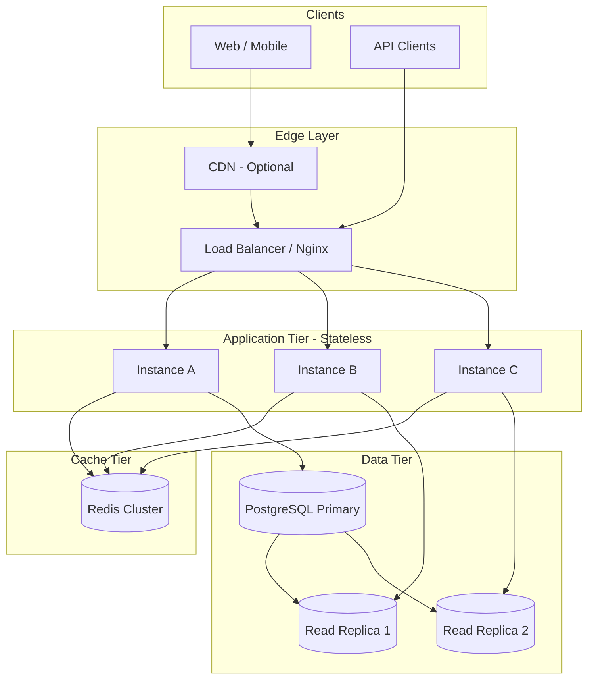
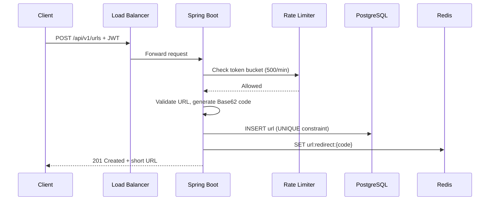
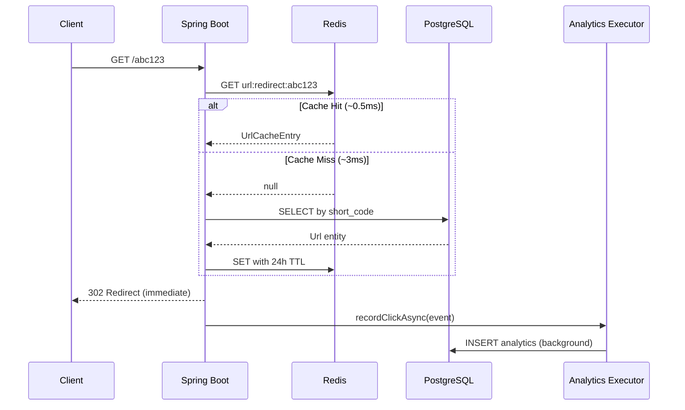
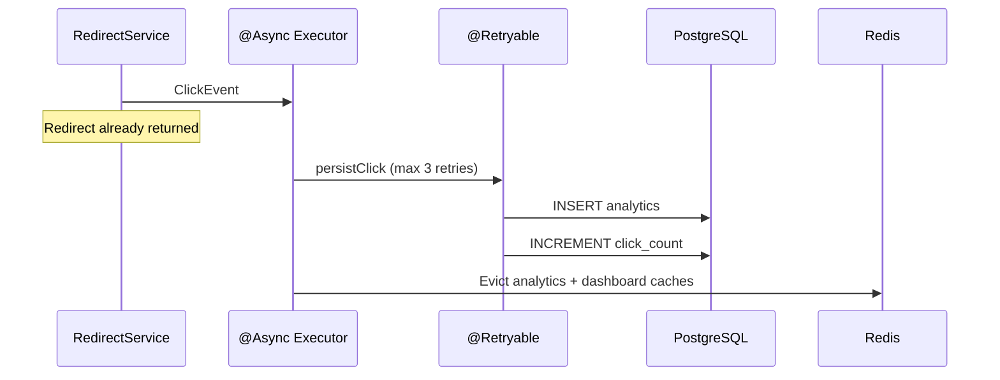
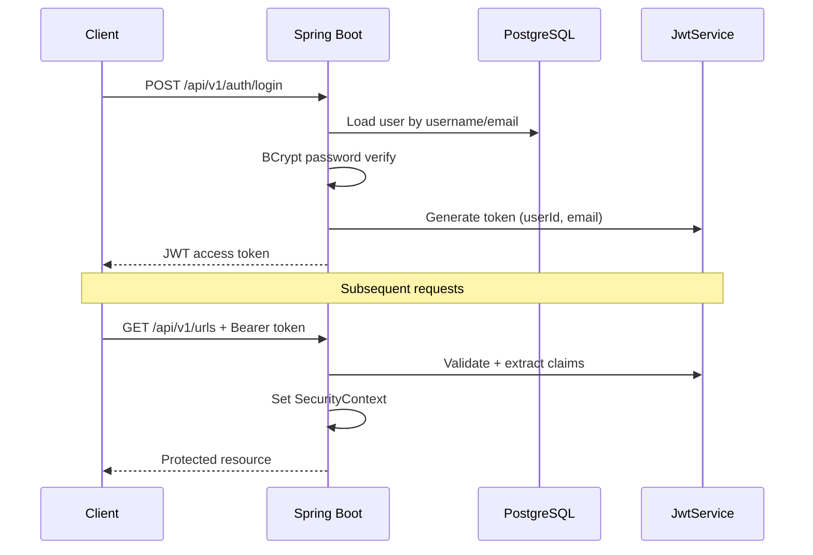

# ScaleLink System Design

## High-Level Architecture



## Request Flow Diagrams

### URL Creation Flow



### Redirect Flow (Hot Path)



### Analytics Flow



### Authentication Flow



---

## Technology Choices

### Why Spring Boot?
- Mature ecosystem for REST, JPA, Security, Actuator
- Fast development with production-ready defaults
- Excellent Micrometer integration for metrics
- Industry standard for enterprise Java backends

### Why PostgreSQL?
- ACID transactions for unique short codes and user ownership
- Strong indexing (B-tree, partial, composite)
- Read replicas for analytics queries
- JSONB support for future metadata

### Why Redis?
- Sub-millisecond reads for redirect hot path
- Atomic operations for distributed rate limiting
- TTL-based cache expiry
- Shared state across horizontally scaled instances

### Why Docker?
- Reproducible builds across dev/staging/prod
- CI/CD pipeline integration
- Blue-green deployment on EC2

### Why JWT?
- Stateless authentication — no session store
- Horizontally scalable — any instance validates tokens
- Self-contained claims (userId, email)

---

## Scalability Analysis

### 100K Redirects/Day (~1.2 RPS avg, ~10 RPS peak)

| Component | Strategy |
|-----------|----------|
| App | 1-2 instances |
| Redis | Single instance, 256MB |
| PostgreSQL | Single primary |
| CDN | Optional |

**Bottleneck:** None at this scale.

### 1M Redirects/Day (~12 RPS avg, ~100 RPS peak)

| Component | Strategy |
|-----------|----------|
| App | 3-5 instances behind ALB |
| Redis | Redis Cluster or ElastiCache |
| PostgreSQL | Primary + 1 read replica |
| CDN | Cache 302 redirects at edge |

**Bottleneck:** PostgreSQL write path for analytics. Mitigated by async processing.

### 10M Redirects/Day (~120 RPS avg, ~1K RPS peak)

| Component | Strategy |
|-----------|----------|
| App | 10-20 instances, auto-scaling |
| Redis | Redis Cluster with read replicas |
| PostgreSQL | Primary + 2-3 read replicas, partition analytics |
| CDN | Required for viral links |
| Analytics | Kafka → ClickHouse/TimescaleDB |

**Bottlenecks:**
1. Analytics table growth → partition by month
2. Redis memory → LRU eviction + CDN for hot URLs
3. Connection pool → tune Hikari per instance

---

## Database Design

### Schema

```
users (id, username, email, password_hash, role, created_at)
urls  (id, original_url, short_code, custom_alias, user_id, click_count, expiration_date, created_at)
analytics (id, url_id, timestamp, country, browser, device, operating_system, referrer, ip_hash)
```

### Index Strategy

| Index | Purpose |
|-------|---------|
| `idx_urls_short_code` UNIQUE | Redirect lookup |
| `idx_urls_custom_alias` UNIQUE partial | Alias lookup |
| `idx_urls_click_count` | Popular URL cache refresh |
| `idx_urls_user_created` | Paginated user URL list |
| `idx_analytics_url_id_timestamp` | Analytics aggregation |

### Query Optimization
- Redirect: single indexed lookup on `short_code` or `custom_alias`
- Analytics: aggregation queries use composite indexes
- User URL list: paginated with `LIMIT/OFFSET` via Spring Data `Pageable`

---

## Caching Design

### Cache-Aside Pattern

```
Read:  Cache → (miss) → DB → populate cache → return
Write: DB → invalidate cache
```

### TTL Strategy

| Cache | TTL | Rationale |
|-------|-----|-----------|
| URL redirect | 24h | Stable data, invalidate on update |
| Analytics summary | 15m | Balance freshness vs load |
| Dashboard | 5m | Near-real-time for users |

### Consistency Tradeoffs
- **Stale reads acceptable** for redirects (TTL-bound)
- **Explicit invalidation** on URL mutations
- **Eventual consistency** for analytics counts

---

## Rate Limiting

### Token Bucket Algorithm

```
capacity = requests_per_minute (100 or 500)
refill_rate = capacity / window_seconds
on request: refill tokens, consume 1, reject if insufficient
```

### Redis Implementation
- Lua script for atomic token bucket operations
- Key: `rate:bucket:ip:{ip}` or `rate:bucket:user:{id}`
- Shared across all instances behind load balancer

### Tiers
| Tier | Limit | Key |
|------|-------|-----|
| Anonymous | 100/min | IP address |
| Authenticated | 500/min | User ID |
| Admin | Unlimited | — |

---

## Reliability

### Failure Scenarios

| Failure | Impact | Mitigation |
|---------|--------|------------|
| Redis outage | Cache miss → DB fallback | Circuit breaker, degraded mode |
| PostgreSQL outage | All writes fail | Read replicas for redirects, queue analytics |
| App crash | Requests to other instances | LB health checks, auto-restart |
| Analytics failure | No click tracking | Async + retry, redirect unaffected |

### High Availability
- Multi-instance deployment behind load balancer
- PostgreSQL streaming replication
- Redis Sentinel or Cluster mode
- Health probes: `/actuator/health/liveness`, `/actuator/health/readiness`

### Disaster Recovery
- Daily PostgreSQL backups to S3
- Redis persistence (AOF) with cross-region replica
- RTO: 1 hour, RPO: 5 minutes (with streaming replication)

---

## Performance Estimates

| Operation | Latency (P95) |
|-----------|---------------|
| Redirect (cache hit) | 1-5 ms |
| Redirect (cache miss) | 10-30 ms |
| Create URL | 20-50 ms |
| Analytics API | 50-200 ms |
| Login | 100-300 ms (BCrypt) |

---

## Security

| Threat | Mitigation |
|--------|------------|
| SQL Injection | JPA parameterized queries |
| XSS | No user HTML rendered; API-only |
| Brute force login | Rate limiting + BCrypt |
| Token theft | Short JWT expiry, HTTPS only |
| IP tracking | SHA-256 hash, no raw IP stored |
