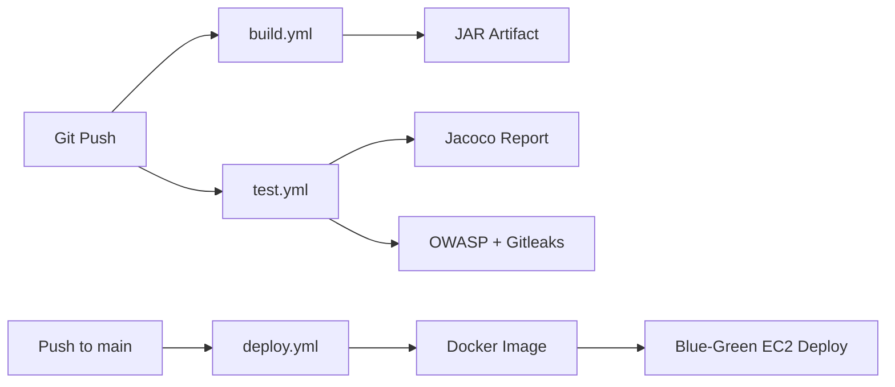

# CI/CD Guide

## Pipeline Overview



## Workflows

### build.yml
- Triggers: push to `main`/`develop`, PRs to `main`
- Java 21 + Maven build
- Dependency validation (`dependency:go-offline`)
- Uploads JAR artifact

### test.yml
- Runs `mvn test` with JaCoCo coverage
- OWASP dependency-check (CVSS ≥ 9 fails build)
- Gitleaks secret detection
- Uploads coverage report artifact

### deploy.yml
- Triggers: push to `main`, manual dispatch
- Builds production Docker image (`Dockerfile.prod`)
- Blue-green deployment to EC2 via SSH
- Requires GitHub secrets: `EC2_HOST`, `EC2_SSH_KEY`

## GitHub Secrets

| Secret | Description |
|--------|-------------|
| `EC2_HOST` | EC2 public IP or hostname |
| `EC2_SSH_KEY` | Private SSH key for EC2 access |

## Local CI Simulation

```bash
# Build
mvn clean package -DskipTests

# Test with coverage
mvn test jacoco:report

# Build production image
docker build -f Dockerfile.prod -t scalink:local .

# Run load test
k6 run load-tests/k6-redirect.js
```

## Branch Strategy

| Branch | CI | Deploy |
|--------|-----|--------|
| `main` | Build + Test | Production |
| `develop` | Build + Test | — |
| Feature branches | Build + Test (via PR) | — |

## Docker Images

| File | Purpose |
|------|---------|
| `Dockerfile` | Default (same as prod) |
| `Dockerfile.dev` | Fast dev builds |
| `Dockerfile.prod` | Optimized production image |
